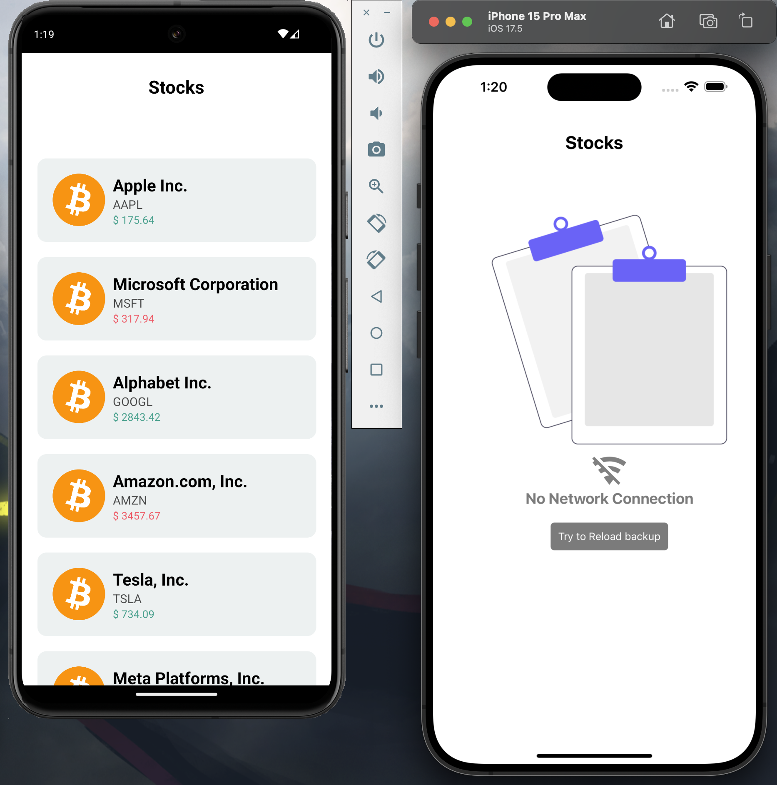

# Talavera Stock-list Test

App for an equity investor who wants to monitor a set of stocks that are on his radar.

### Setup Environment

The project was created in react native with expo and typescript. [ See official docs](https://reactnative.dev/) to set up the environment.


### Run

**Environment**

Remember that for the correct functioning of the project it is necessary to have android studio, xcode configured or have a physical phone and the latest expo update to at least run the app on a device.

**Install dependencies**

```
npm install
```

**Init project**
```
npx expo start
```
**Run IOS**

once the expo terminal has been started, press the “i” key or execute the following command in another terminal:

```
npx ios
```

**Run Android**
once the expo terminal has been started, press the “a” key or execute the following command in another terminal:

```
npx android
```

### 🛠 Tech and Libraries

- [React-Native](https://reactnative.dev/): Library to make native ios/android code
- [expo](https://expo.dev/): Framework to make native ios/android code
- [TypeScript](https://www.typescriptlang.org/): Application typing stronger
- [Zustand](https://redux-toolkit.js.org/Í): Data storage more  efficient and easy to handler than Redux or Redux Toolkit
- [jest / @testing-library/react-native](https://testing-library.com/docs/react-native-testing-library/intro/):Library for test sweep
- [mmkv](https://github.com/mrousavy/react-native-mmkv): unfortunately with expo it does not work in development time, only in build time.

### App Screenshots

|                                 |                                     Mobile                                  |
| :------------------------------:| :--------------------------------------------------------------------------:|
|               Screen 1          |                                               |
|               Screen 2          |                                               |


# Command tree for the files

```
├── README.md
├── app
│   └── index.tsx
├── app.json
├── assets
│   ├── fonts
│   │   └── SpaceMono-Regular.ttf
│   └── images
│       ├── adaptive-icon.png
│       ├── favicon.png
│       ├── icon.png
│       ├── noData.png
│       ├── partial-react-logo.png
│       ├── react-logo.png
│       ├── react-logo@2x.png
│       ├── react-logo@3x.png
│       ├── screen1.png
│       ├── screen2.png
│       └── splash-icon.png
├── expo-env.d.ts
├── modules.d.ts
├── package-lock.json
├── package.json
├── setupTests.js
├── src
│   ├── components
│   │   ├── app
│   │   │   ├── FlatListStock.tsx
│   │   │   ├── __tests__
│   │   │   │   └── FlatListStock.test.tsx
│   │   │   └── index.ts
│   │   └── ui
│   │       ├── SafeWrapper.tsx
│   │       ├── StockCard.tsx
│   │       └── index.ts
│   ├── hooks
│   │   ├── index.ts
│   │   └── useNetworkConnection.ts
│   ├── store
│   │   ├── index.ts
│   │   ├── persistStore.ts
│   │   ├── stock.ts
│   │   └── types
│   │       ├── index.ts
│   │       └── stock.ts
│   ├── test
│   │   ├── index.ts
│   │   ├── mocks
│   │   │   ├── dummyMock.ts
│   │   │   └── index.ts
│   │   └── test-env.tsx
│   ├── types
│   │   ├── dummyData.ts
│   │   └── index.ts
│   └── utils
│       ├── const
│       │   ├── dummyData.json
│       │   ├── index.ts
│       │   ├── number.ts
│       │   ├── phoneDimensions.ts
│       │   └── string.ts
│       ├── index.ts
│       ├── isIOS.ts
│       └── theme
│           ├── index.ts
│           └── theme.ts
└── tsconfig.json
```